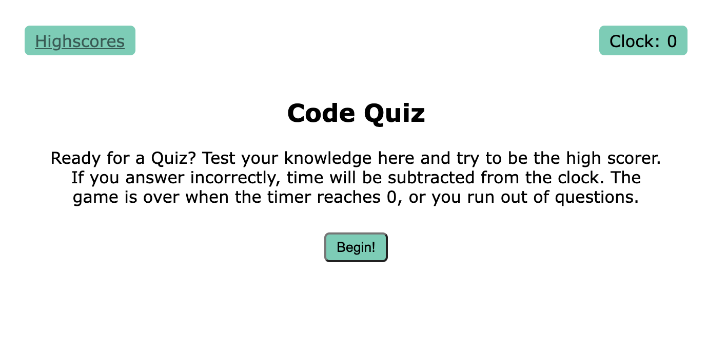
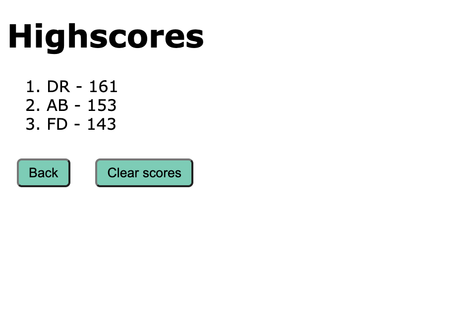

# wk4-Homework-DH
Homework repo for wk4-Javascript Web APIs: Code Quiz
https://ila0406.github.io/Code-Quiz/

## User Story
As a student, I want to take a timed quiz that tests me on the fundaments of Javascript then stores the highscores. This way I can gauge my progress compared to my peers

## Accessibility
Lighthouse report on accesibility

## Mock-Up 

The following images shows the mokup of the web application's appearance and functionality. 

### Mockup

### Opening Screen
Explains the code quiz to the user

### Example Question
Example of one of the questions in the quiz

### Game Over
Presents the final score and allows the user to submit their initals

### Highscores
Presents all Highscores stored locally and the ability to clear the list

